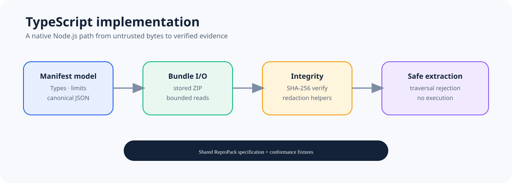

# ReproPack for TypeScript

<p align="center">
  
</p>

<p align="center"><strong>Native TypeScript support for the language-neutral ReproPack evidence-bundle format.</strong></p>

<p align="center">
  <a href="https://github.com/ReproPack/repropack-typescript/actions/workflows/ci.yml"></a>
  <a href="LICENSE"></a>
  <a href="https://github.com/ReproPack/repropack-core/blob/main/docs/SPECIFICATION.md"></a>
</p>

This implementation reads and writes ReproPack bundles without invoking Rust. It is designed for Node.js applications that need deterministic manifests, SHA-256 verification, conservative redaction, and safe extraction.

## What you get

- typed manifest validation and canonical JSON;
- stored-ZIP bundle creation and reading;
- integrity verification and explicit redaction helpers;
- bounded reads and safe extraction that rejects unsafe paths;
- shared semantic fixtures used by the ReproPack ecosystem.

The canonical specification lives in [repropack-core](https://github.com/ReproPack/repropack-core/blob/main/docs/SPECIFICATION.md). This package is currently marked `private: true` while npm publication and entry-point decisions are reviewed.

## Quick start

```bash
npm ci
npm run typecheck
npm test
```

The public SDK surface is exported from `src/model.ts`, `src/bundle.ts`, and `src/redaction.ts`. Build the package with:

```bash
npm run build
npm pack --dry-run
```

For the format walkthrough, see the Core [tutorial](https://github.com/ReproPack/repropack-core/blob/main/docs/TUTORIAL.md).

## Project map

| Need | Start here |
| --- | --- |
| Understand the format | [Core specification](https://github.com/ReproPack/repropack-core/blob/main/docs/SPECIFICATION.md) |
| See TypeScript API behavior | [Specification mapping](docs/SPECIFICATION_MAPPING.md) |
| Understand implementation boundaries | [Architecture](docs/ARCHITECTURE.md) |
| Run tests and contribute | [Development guide](docs/DEVELOPMENT.md) |
| Review compatibility | [Conformance guide](docs/CONFORMANCE.md) |
| Follow project progress | [Roadmap](ROADMAP.md) |

## Status

The current implementation passes the shared semantic fixtures and the coordinated cross-language interoperability matrix. Future integrations and npm publication are not implied by that result.

## License

MIT. See [LICENSE](LICENSE).
